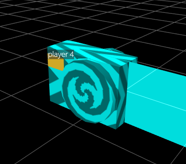

# WakeOfDeath
a 3d web game using Three.js  demo地址：http://39.108.173.192:8081/

# 死亡尾流说明文档

------1552700_武杰

死亡尾流是一个单机的人机对战web游戏，玩家和4个AI一起，通过控制自己的机车，利用形成的尾流来阻挡别人的前进路线，如果撞到别人或自己的尾流，或者撞到地图边境时，就会死亡。游戏功能介绍如下：

## 一、使用方法

命令行切换到项目目录，cnpm install安装相关依赖，node server.js启动，使用chrome浏览器打开localhost:8081端口即可。

由于是人机对战，所以玩家可以通过方向键AD控制前进的方向，玩家是曲线运动，角度转动的速度会随着按键的时间逐渐增加。对于机器人，由于使用曲线行走的办法对算法的要求很高，所以没有实现，AI只能直线行驶和90°转向。

## 二、游戏截图和功能

### a)        开始界面

### b)        游戏画面

### c)        死亡画面

死亡之后有一个粒子特效的画面：

​         死亡之后，视角会切换到其他玩家，而且在屏幕上会出现按Z键复活，X键复活敌人的提示，如果四个敌人都没死的话就只有Z键复活的提示：

### d)        视角切换

使用C键可以切换视角：自由视角，玩家可以使用鼠标控制视角的方位：

俯视视角，视角切换到最顶端：

除此之外，还有第一人称视角，45°远视角，这里就不截图了。

### e)        机车模型切换

可以使用数字键5切换车头模型，如下图所示：

 

### f)         尾流样式切换

数字键1、2、3可以跟换尾流的样式，分别是闪电、透明、不透明三种，下图给出一种：

### g)        空格键减速

使用空格键可以减速，机车行驶的速度会减慢，但是不会特别慢，机车的速度可以在左下角的SPEED条目中实时的查看。

### h)        i键开启方向标

由于玩家是曲线行驶，如果没有方向标的话会很容易出现转弯角度过大然后自己撞到自己的情况，开启向标之后可以便于操控。

### i)  ‘<’或’>’键切换玩家视角，这两个按键可以让玩家在几个机车的视角之间随意的切换

### j)  ‘~’键可以使玩家变成AI自动驾驶

这个键可以让机车自动行驶，并会在玩家头顶会出现一个星星的标志，不过行驶方式会变成直线行驶：

### k)        其他

对于所有按键的功能，我都定义在了keyboard.js文件中，其他别的小功能，可以上编码看。

## 三、实现

### a)        框架和库

1.        Express

项目使用的是Express框架，这是一个小框架，主要作用是为了方便命令行启动项目，本来是为了方便和Socket.io结合做一个多人的联机游戏，但后来发现做有AI的人机对战对代码要求更高，于是没有做多人对战。

2.        Three.js

游戏引擎使用的是Three.js库，这个库目前是WEB3D游戏引擎中最成熟的引擎之一，它庞大而且稳定，项目维护的很好而且有很多学习资料。刚开始的时候我有试过使用Phaser.js，但是Phaser引擎版本控制做的不好，最新的v3没有详细的文档，而且有很多BUG，所以我改用Three.js了。

3.        ramda.js

使用这个库是为了方便编写风格统一的代码，ramda.js是一个专注于JS函数式编程的库，相比现在Vue、React的组件试编程，ramda.js更贴近原生JS，不至于让人觉得自己是在写别的语言。

使用 Ramda 时，应该感觉像使用原生JavaScript 一样，它是实用且函数式的 JavaScript。Ramda 基本的数据结构都是原生 JavaScript 对象，还保留了许多其他原生 JavaScript 特性。

函数式编程优势主要体现在数据不变性和函数无副作用两方面。虽然 Ramda 没有对此特别加强，但它在这两方面支持的非常好。

地址：<http://ramda.cn/>

4.        FullScreen.js

这个是Three.js的辅助库，使用这款THREEx助手可以轻松处理全屏API，它隐藏了每个浏览器的前缀，它在编写本文时隐藏了各种供应AP的小差异，它可以在使用firefox或者webkit时保持稳定。

文档地址在：<http://learningthreejs.com/data/THREEx/docs/THREEx.FullScreen.html>

5.        OrbitControls.js

轨道控制器OrbitControls.js是一个相当神奇的控件，用它可以实现场景用鼠标交互，让场景动起来，控制场景的旋转、平移，缩放。项目中视角的切换，自由视角模式下用鼠标控制视角都是使用这个库实现的。

6.        stats.min.js

Three.js的性能插件，添加了以后会默认在左上角显示性能帧数，每次刷新所用时间，占用内存。鼠标左键点击可进行切换，默认显示每秒的帧数等。

7.        buffer-loader.js

用来实现音频的缓冲播放的库。它可以将Web Audio API音频缓冲区加载过程抽象为名为BufferLoader的自定义函数，这可以减少加载音频资产时所需的代码量。

使用Web AudioAPI，音频文件只有在加载到缓冲区后才能播放。使用XMLHttpRequest将数据从音频文件加载到缓冲区中，异步回调并发送实际的请求加载。一旦声音被缓冲和解码，它可以立即触发。每次触发时，都会创建一个不同的缓冲声音实例。

地址：<http://middleearmedia.com/web-audio-api-bufferloader/>

### b)        机车模型

#### 1.        初始模型

Three.js支持使用JS搭建模型，也可以通过加载json文件生成模型，这个模型是使用JS搭建的。这个是使用了一个大神所作的模型，可以在他的主页上找到更多用于Three.js的模型。

地址：<https://mrdoob.com/>

#### 2.        替换模型

这个模型是通过导入1982.json这个文件生成的。

#### c)        声音

声音文件主要是从Three.js的样例游戏中找到的，通过buffer-loader.js和sound.js两个文件加载和播放声音。通过判断机车的运行状态来切换声音的播放。

#### d)        爆炸效果和尾流

1.        尾流

这个就是使用Three.js中的object接口实现的，通过定义长度、宽度来实现即可，不贴代码了。

2.        爆炸

爆炸效果的原理和尾流其实是一样的，主要思想是先定义一个方位数组dirs，随机生成多个方位，在每一个方位上，添加随机个数的比较小的尾流碎片，然后沿着这些方位逐一显现出来，最后统一从世界中删除即可